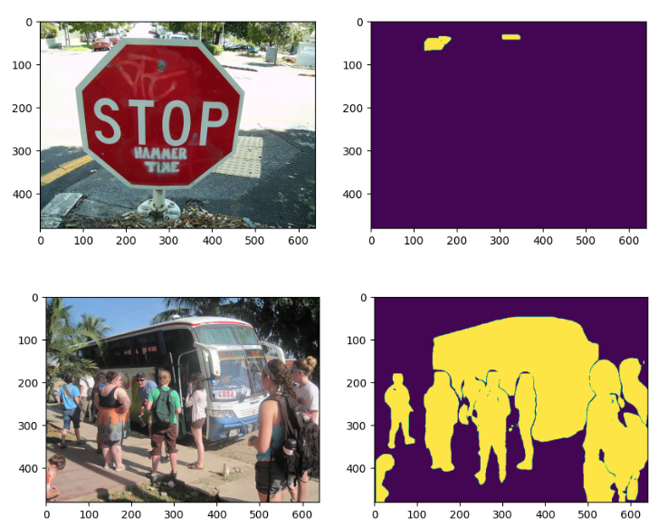
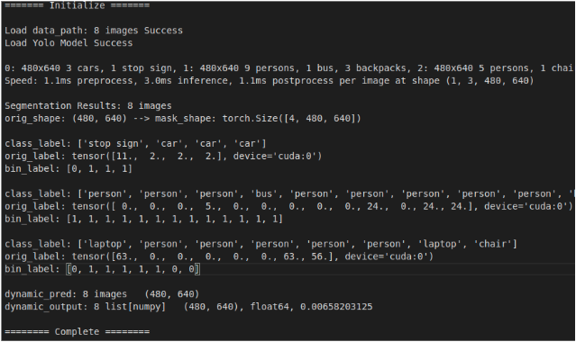

# Dynamic Obejct Semantic Segmentation using Yolov8

<p align="left"></p>
<p align="left"></p>

## Descipline
* Visual SLAM, Semantic Segmentation 기술을 융합하여 동적 물체가 존재하는 상황에서의 측위 및
지도작성을 더 정확하게 수행할 수 있음.          
* ORB [3] , SIFT [4] 등의 feature extractor로 이미지의 feature를 추출후, Semantic Segmentation 결과 중 동적물체 mask에 해당하는 feature를 제거.            
* 이후 남아있는 정적인 feature들을 이용하여 visual odometry 진행함으로 동적환경에서도 강인하게 동작하는 visual SLAM구현가능            
* Visual SLAM은 연속된 이미지 프레임들에서 추출한 2D feature들이 카메라의 위치가 이동하는 동안에도, 움직이지 않는다고 가정.         
* 정적인 feature의 경우에는 순수한 camera의 모션만 계산되지만, feature가 움직이게 되면, 카메라와 feature간의 상대적인 움직임이 계산되기 때문에, 실제 카메라의 움직임과 차이가 발생하여 성능이 저하됨.            
* 따라서, 본 과제에서는 semantic segmentation으로 동적인 물체를 인식 및 제거하여, 동적물체가 존재하는 환경에서도 강건한 측위를 가능하도록 하는 것을 목표로 함.          

## Yolov8
### Config
```
    Train Dataset: COCO Dataset (80 class)            
    Dynamic & Static Class: 19 vs 61 class            
    Infernce Duration per image: i.1ms preprocess + 3.0ms inference + 1.1ms postprocess = 5.2ms            
    Test Inference Image Size: (480, 640)            
    Test GPU: RTX 2080Ti            
```

## Future Work
```
    C 개발 환경 포팅.            
    so파일 구축하여 C 호환 여부 확인.            
    ORB SLAM에 이식하여 Dynamic Object Feature Removal            
```

