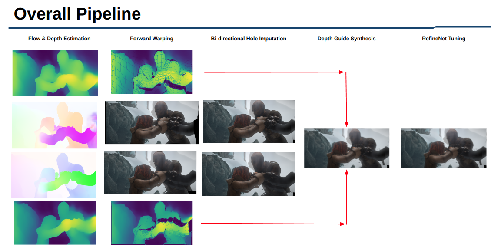

# 🎞️ Optical Flow + Monocular Depth Guide Video Frame Interpolation

## Link
Notion: [Video Frame Interpolation Notion](https://www.notion.so/Video-Frame-Interpolation-b3f639b21ad34b09a72aa2b3325da9f3)

## Descipline

<p align="left"></p>

* Visual SLAM, Semantic Segmentation 기술을 융합하여 동적 물체가 존재하는 상황에서의 측위 및
지도작성을 더 정확하게 수행할 수 있음.          
* ORB [3] , SIFT [4] 등의 feature extractor로 이미지의 feature를 추출후, Semantic Segmentation 결과 중 동적물체 mask에 해당하는 feature를 제거.            
* 이후 남아있는 정적인 feature들을 이용하여 visual odometry 진행함으로 동적환경에서도 강인하게 동작하는 visual SLAM구현가능            
* Visual SLAM은 연속된 이미지 프레임들에서 추출한 2D feature들이 카메라의 위치가 이동하는 동안에도, 움직이지 않는다고 가정.         
* 정적인 feature의 경우에는 순수한 camera의 모션만 계산되지만, feature가 움직이게 되면, 카메라와 feature간의 상대적인 움직임이 계산되기 때문에, 실제 카메라의 움직임과 차이가 발생하여 성능이 저하됨.            
* 따라서, 본 과제에서는 semantic segmentation으로 동적인 물체를 인식 및 제거하여, 동적물체가 존재하는 환경에서도 강건한 측위를 가능하도록 하는 것을 목표로 함.    

### Datasets
  * [Vimeo-90k-septuplet](http://toflow.csail.mit.edu/index.html#septuplet)      
  * Adobe240fps      
  * Sintel      
  * UCF101      
  * Davis      

## Train & Test
```shell
   # Train
   python train.py --flow_model --depth_model --data_root --out_root --softsplat

   # Test
   python test.py --flow_model --depth_model --data_root --out_root --softsplat
   
   # Test without refinet
   python test_without_refine.py --flow_model --depth_model --data_root --out_root --softsplat      
```      

